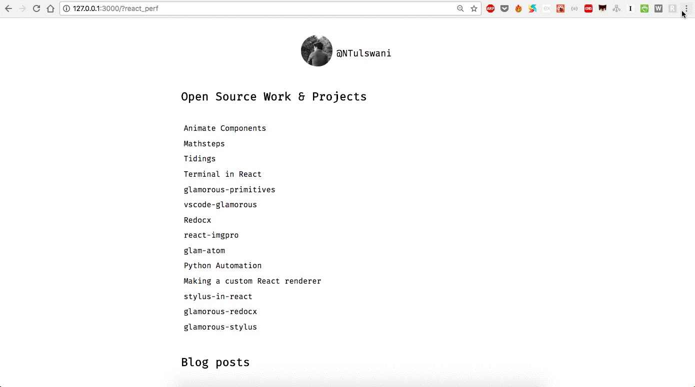

# React Performance Devtool
[](https://travis-ci.org/nitin42/react-perf-devtool)


> A chrome devtool extension for inspecting the performance of React Components

<br/>

<p align="center">
  
</p>

<br/>

## Table of contents

* [Introduction](#introduction)

* [Demo](#demo)

* [Uses](#uses)

* [Install](#install)

* [Usage](#usage)

* [Phases](#phases)

* [Contributing](#contributing)

* [Closure](#closure)

* [License](#license)


## Introduction

**React Performance Devtool** is a Chrome extension for inspecting the performance of React Components. It statistically examines the performance of React components based on the measures which are collected by React using `window.performance` API.

This project started with a purpose of extending the work done by [Will Chen](https://github.com/wwwillchen) on a proposal for React performance table. You can read more about it [here](https://github.com/facebook/react-devtools/issues/801#issuecomment-350919145).

## Demo

A demo of the extension being used to examine the performance of React components on my website.



## Uses

* Remove or unmount the component instances which are not being used.

* Inspect what is blocking or taking more time after an operation has been started.

* Examine the table and see for which components, you need to write [shouldComponentUpdate](https://reactjs.org/docs/react-component.html#shouldcomponentupdate) lifecycle hook.

* Examine which components are taking more time to load.

## Install

The below extensions represent the current stable release.

* [Chrome extension](https://chrome.google.com/webstore/detail/react-performance-devtool/fcombecpigkkfcbfaeikoeegkmkjfbfm)
* [Firefox extension](https://addons.mozilla.org/en-US/firefox/addon/nitin-tulswani/)
* **Standalone app coming soon**

## Usage

To use this tool in development mode, you'll need to comment one line in `react-dom` package so that the performance measures can be apprehended by this tool. To do this, go to `node_modules/react-dom/cjs/react-dom.development.js` inside your project folder and comment this line,

```
performance.clearMeasures(measurementName);
```
> You can find this line inside the `endMark` function.

Next, start your local development server and go to `http://localhost:3000/?react_perf`.

The query parameter `react_perf` is required so that React can measure the performance timings.

> Note - This extension works only for React 16 or above versions of it.

After you've installed the extension successfully, you'll see a tab called **React Performance** in Chrome Developer Tools.


**Note -**

This is a rudimentary tool and still needs a lot of work internally. Right now, this will only work with React 16 plus it may break later when there is a new update (async rendering in React). Displayed stats and results for async rendered components will be completely different when compared to what is shown currently. Also, I think it would be waste of time if I work on adding cosmetic features (not saying that it's useless but, time is a big constraint). I've plans to improve this tool further which includes :

- [ ] New UI

- [ ] Compatibility with older versions of React

- [ ] Custom themes

- [ ] Accessibility


### Description

<p align="center">
  
</p>

**clear** - The clear button clears the measures from the tables and also wipes the results.

**Reload the inspected window** - This button reloads the inspected window and displays the new measures.

**Pending events** - This indicates the pending measures (React performance data).

**Table** - The table shows the time taken by a component in a phase, number of instances of a component and total time combining all the phases in **ms** and **%**.

**Results** - This shows the following stats:

* Time taken by all the components:

* Time duration for committing changes

* Time duration for committing host effects

* Time duration for calling lifecycle methods

* Total time

## Phases

Given below are the different phases for which React measures the performance:

* **React Tree Reconciliation** - In this phase, React renders the root node and creates a work in progress fiber. If there were some cascading updates while reconciling, it will pause any active measurements and will resumed them in a deferred loop. This is caused when a top-level update interrupts the previous render. If an error was thrown during the render phase then it captures the error by finding the nearest error boundary or it uses the root if there is no error boundary.

* **Commit changes** - In this phase, the work that was completed is committed. Also, it checks whether the root node has any side-effect. If it has an effect then add it to the list (read more this list data structure [here](https://github.com/nitin42/Making-a-custom-React-renderer/blob/master/part-one.md)) or commit all the side-effects in the tree. If there is a scheduled update in the current commit, then it gives a warning about ***cascading update in lifecycle hook***. During the commit phase, updates are scheduled in the current commit. Also, updates are scheduled if the phase/stage is not [componentWillMount](https://reactjs.org/docs/react-component.html#componentwillmount) or [componentWillReceiveProps](https://reactjs.org/docs/react-component.html#componentwillreceiveprops).

* **Commit host effects** - Host effects are committed whenever a new tree is inserted. With every new update that is scheduled, total host effects are calculated. This process is done in two phases, the first phase performs all the host node insertions, deletion, update and ref unmounts and the other phase performs all the lifecycle and ref callbacks.

* **Commit lifecycle** - When the first pass was completed while committing the host effects, the work in progress tree became the current tree. So work in progress is current during **componentDidMount/update**. In this phase, all the lifecycles and ref callbacks are committed. **Committing lifecycles happen as a separate pass so that all the placements, updates and deletions in the entire tree have already been invoked**.

## Closure

This extension provides the performance measurements for the React components and supports only React 16 at the moment. However, you can profile your React components using Chrome devtools and reason about the performance by inspecting the user timeline. Also, you can see that the tool is very minimal. I've plans to extend this project further but I'm anticipating that React may provide an API for measuring the performance (which could ease the process) and also enable async rendering.

You can read more about optimizing performance and profiling React components at React's [official documentation](https://reactjs.org/docs/optimizing-performance.html#profiling-components-with-the-chrome-performance-tab).

## Contributing

[Read the contributing guide](./CONTRIBUTING.md)

## License

MIT
